#　JMH  Test  And Profiler Of  ECDSA In Openjdk-11 Using Different  Elliptic Curve

**Project Background**

- [2022腾讯犀牛鸟开源人才培养计划-Tencent konajdk](https://github.com/Tencent/OpenSourceTalent/issues/34)
- [task requirement](https://docs.qq.com/doc/DUXhGSXBHZG11eUJ0?&u=74e860a5fae94e43acca426785a43265)

Overall, in this task, we will write test programs to test the performance of ECDSA in OPENJDK11, including using two different elliptic curves secp256r1 and secp256k1. The test tools used include JMH, Java Profiler.

# Preparement

**Basic knowledge**

- public key cryptography
- Elliptic-curve cryptography (*ECC*)
- ECDSA 
- Digital Signature Usage in OpenJDK
- JMH
- Java Flight Recorder
- async-profiler

Share a good  introduction of ECC:

- [Elliptic Curve Cryptography: a gentle introduction](https://andrea.corbellini.name/2015/05/17/elliptic-curve-cryptography-a-gentle-introduction/)

- [trans in Chinese](https://www.zhihu.com/column/c_125618851)


# Run

The basic usage demo of ECDSA can be refered to ../OpenJDKTest/ECDSATEST/src/main/java/ECDSA/DigSig.java

For JMH Test:

The JMH test demo can be refered to ../OpenJDKTest/ECDSATEST/src/test/java/ECDSA/TestDigSig

For Profiler Test:

The profiler test demo can be refered to ../OpenJDKTest/ECDSATEST/src/test/java/ECDSA/TestDigSigForAsyncProfiler.java

IntelliJ IDEA is integrated with Async Profiler and Java Flight Recorder, we can directly use IDEA to do profiler. Besides, we can use async profiler and JFR in command line.

After the JMH test we will get the result.json file, the Visualization results can be obtained by [JMH Visualizer ](https://jmh.morethan.io/).

After the profiler test we will get the jfr file, we can use jfr-flame-graph tool to generate a flame graph, which have to be executed in Linux. 

Some help refs:

- [IntelliJ Profiler](https://lp.jetbrains.com/intellij-idea-profiler/)
- [jfr-flame-graph](https://github.com/xpbob/jfr-flame-graph)
- [async-profiler](https://github.com/jvm-profiling-tools/async-profiler)

# Result  of  JMH  Test

First, compare the performance of secp256r1 and secp256k1.

Main control parameters:

```java
@Warmup(iterations = x);
@Measurement(iterations = x); 
Random random = new Random(x);//random seed to generate source data for sign/verify
@Param({"7","8","10","20"});//to generate differnt data size, including 128B,256B,1024B,1024K in each JMH test 

```

For simplicity, the following format ' r1-sd7-w5-m5' is used to represent parameters. Its representative: curve 256r1-random seed 7 - warmup 5 times - measurement 5 times.

Each warmup or measurement, the default time is 10s.

Each test will collect the results of four data sets , e.g., 128B($2^7$), 256B($2^8$), 1024B($2^{10}$), 1024K($2^{20}$), which are implemented by @Param({"7","8","10","20"}) in the program.


## Experimental results

**r1-s7-w5-m8 and k1-s7-w5-m8**

The first Fig is the result using  256r1 curve and the second is using 256-k1


**r1-s17-w5-m8 and k1-s17-w5-m8**


**r1-s7-w8-m3 and k1-s7-w8-m3**


**r1-s7-w12-m12 and k1-s7-w12-m12**


## **Conclution**

We can draw two conclusions here:

- **Secp256r1 has better sign performance than Secp256k1.** This can be seen in all comparative results.
- **As the dataset grows, the overhead of ECDSA  grows slowly.** This also illustrates the practical usability of the ECDSA.


## **Discussion**

**The computation cost  of the algorithm.** We can see that in all the test results, the experiment with a data size of 1024KB takes more time than the other same conditions. However, the computation overhead grows slowly as the dataset grows. Although the data increased from 1024B to 1024KB, an increase of $2^{10}$ times,  the time-consuming increased by about 15%-30%. When the data set increase is not obvious, the increase in computation cost cannot be clearly seen. Fluctuations in results may come from instability in operating system program scheduling.


# Result of Profiler

You get these original svg files in ../OpenJDKTest/flame-graph/  folder.

## cpu flame graph ECDSA-secp 256 r1


### sign

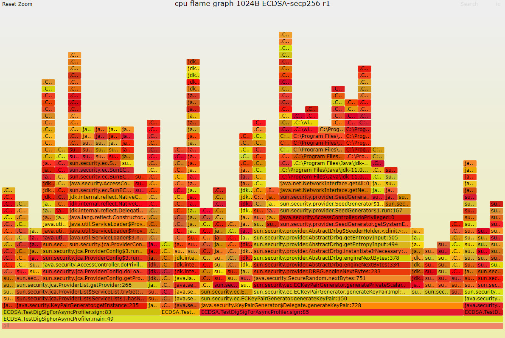

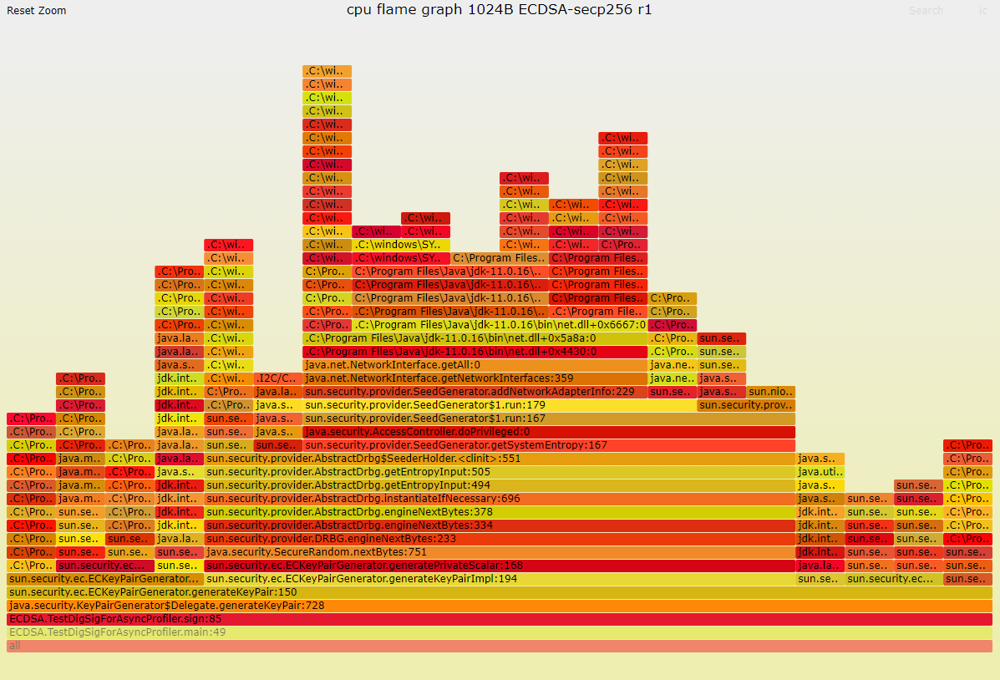

### verify

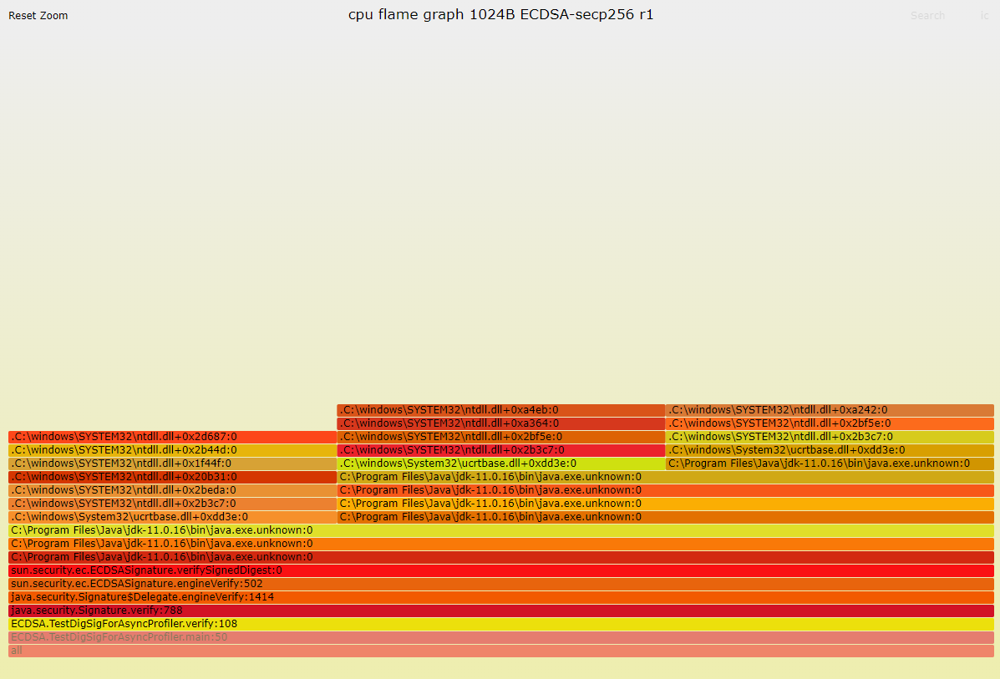

## allocation flame  graph ECDSA-secp 256 r1

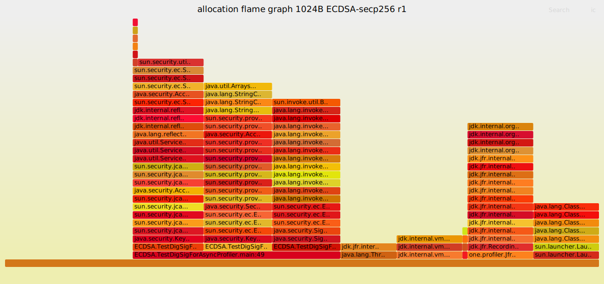

### sign

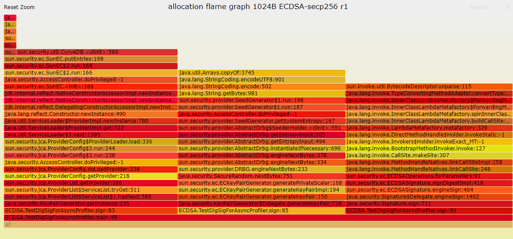


## cpu flame graph ECDSA-secp256 k1

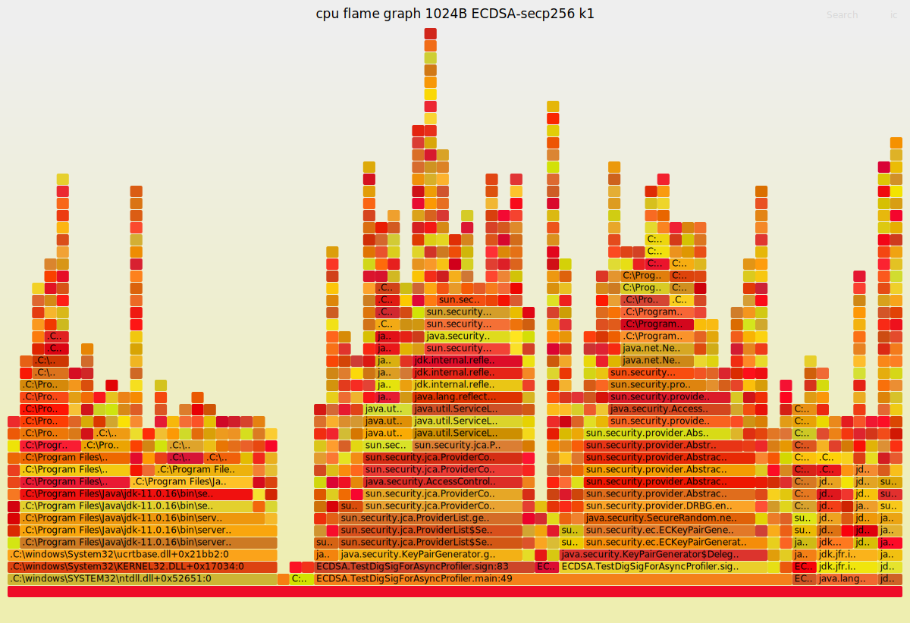

### sign

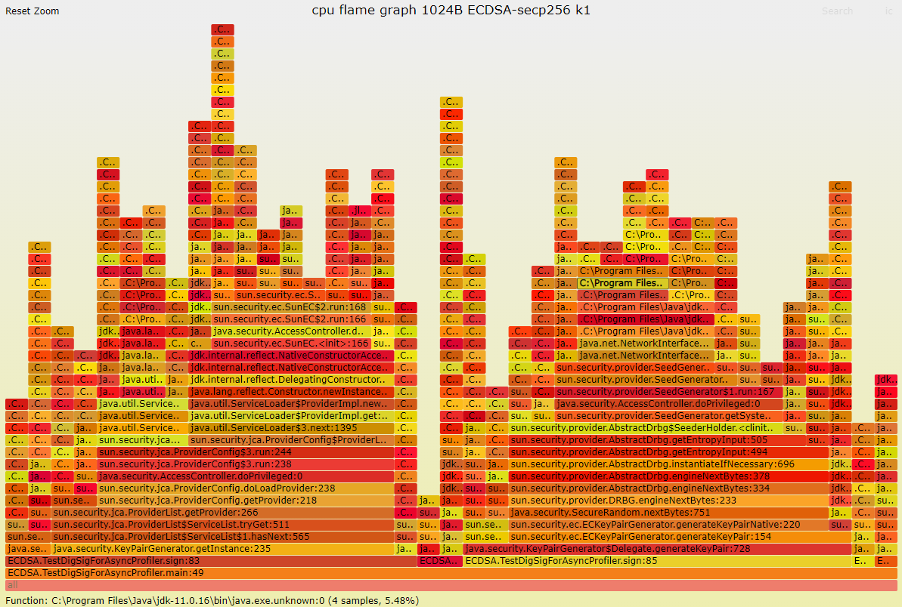

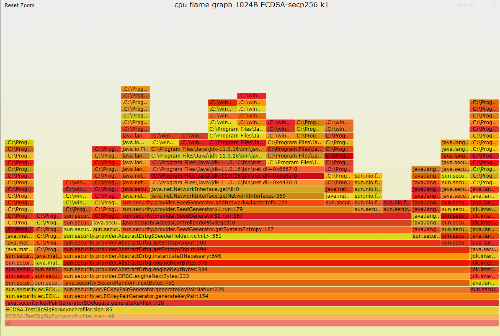

### verify

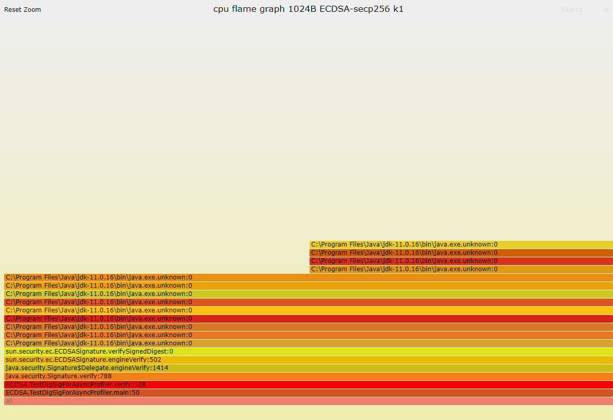

## allocation flame graph ECDSA-secp256 k1

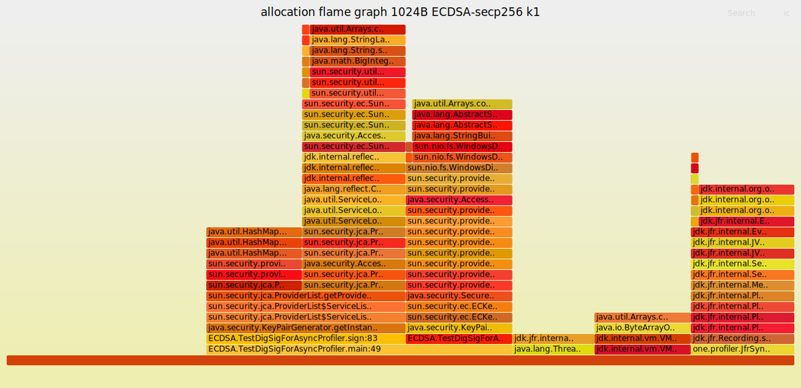

### sign

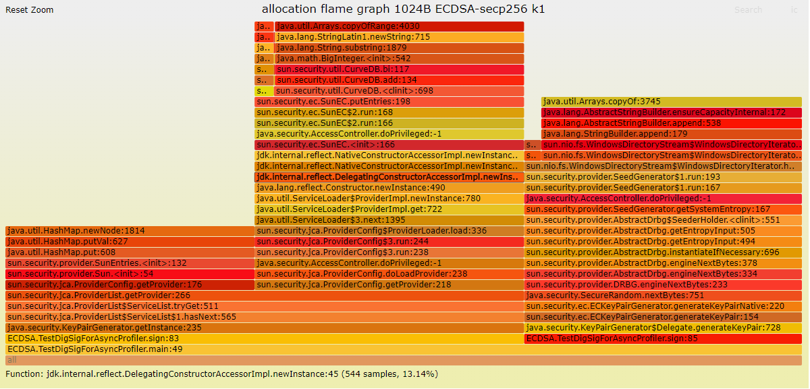

## Conclusion and Discussion

When  doing a profiler, the sign/verify method is executed in one program, and it can be seen that verify parse does not consume new memory overhead in the allocation profiler, at least not found in the sampling.

Compared with verify, sign needs to generate private key and public key, and its call stack is deeper. The original intention of this design is that generally the verifyer will directly receive the signer's public key.


